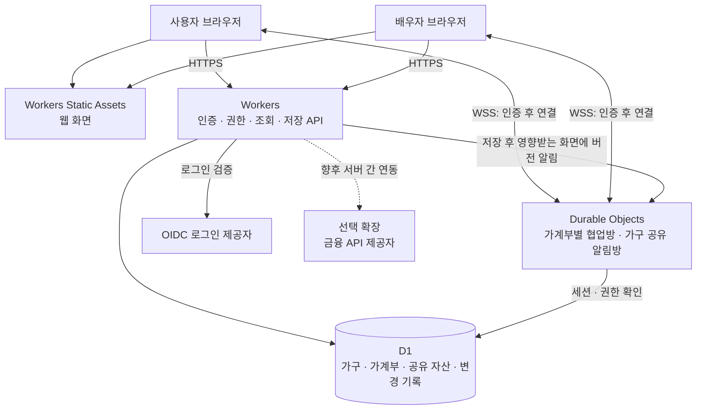

# 부부 공동 가계부 시스템 구성 기준서

| 항목 | 내용 |
| --- | --- |
| 문서 버전 | v1.1 |
| 작성일 / 외부 서비스 정보 확인일 | 2026-09-16 |
| 목적 | 원본 엑셀을 참고하되 최신 기능 결정에 맞춘 웹 가계부의 시스템 구조·데이터·협업·운영 기준 정의 |
| 적용 대상 | 부부 2명이 함께 조회하고 편집하는 비공개 가계부 |
| 기본 배포 구성 | Cloudflare Workers Static Assets + Workers + D1 + SQLite 기반 Durable Objects |
| 비용 목표 | 현재 사용 규모에서 Cloudflare 무료플랜 한도 내 운영 |
| 검증 상태 | 원본 파일 분석 및 공식 문서 조사 완료. 애플리케이션 구현·배포·성능 실측은 아직 수행하지 않음 |

기능 범위의 기준은 [기능 정의서](/Users/joonchi/Budget/docs/functional-requirements.md)다. 본 문서는 해당 기능을 제공할 시스템 구성을 정의한다. v1.1은 기능 제외·통합, 태그 처리 규칙, 독립 목적 가계부와 메인 연결 요구를 반영한다. 원본의 모든 화면·데이터를 그대로 보존한다는 초기 가정보다 최신 기능 결정을 우선한다.

## 1. 핵심 결정

**가계부 데이터는 D1에 저장하고, 실시간 연결은 접속 상태·선택 셀·저장된 변경사항을 공유하는 데 사용한다.**

사용 빈도가 낮아도 별도 서버를 수동으로 켜는 운영을 요구하지 않는 구성을 목표로 한다. 평소에는 거의 사용하지 않다가 한 달 치를 한 번에 정리하는 이용 방식도 지원한다.

### 1.1 대화에서 정한 기준

| ID | 결정 |
| --- | --- |
| DEC-01 | 원본 엑셀을 기능 검토의 출발점으로 삼고, 최신 결정에 따라 제외·통합·확장한 기능 정의서를 이행한다. |
| DEC-02 | 부부가 각자 로그인해 같은 가구의 메인·목적 가계부와 공유 자산·카드/통장 정보를 조회하고 편집한다. |
| DEC-03 | 상대방의 접속 여부와 편집 중인 셀을 표시하고, 입력 완료 후 저장된 값을 즉시 공유한다. |
| DEC-04 | 같은 항목의 동시 수정은 충돌을 감지하고 사용자에게 알린다. |
| DEC-05 | 글자 단위 동시 병합, 노션 수준의 문서 편집 엔진은 초기 구성에 포함하지 않는다. |
| DEC-06 | Workers + D1 + Durable Objects의 무료플랜을 기본 배포안으로 삼는다. |
| DEC-07 | Toss·카드사 등의 수입·지출 API 연동은 선택 기능이다. 이용 가능 여부·비용·보안을 먼저 조사한다. |
| DEC-08 | 자산관리에서 일반 자산 항목인 예비금·투자금·전세금과 대출 등 부채를 함께 관리한다. 카드와 통장은 한 관리 영역으로 통합한다. |
| DEC-09 | 지출 귀속은 본인·배우자·공동으로 구분한다. 태그 분석과 명시적으로 설정한 거래 처리 규칙을 제공한다. |
| DEC-10 | 카드 구매 거래는 지출에 한 번 반영하고, 예정 청구액·납부일은 별도 카드 정보로 관리한다. 청구·납부 정보로 지출을 다시 생성하지 않는다. |
| DEC-11 | 목적 가계부는 기간·예산·항목을 독립 관리한다. 선택적으로 메인에 연결해 합산 조회하며, 거래는 원래 가계부에서만 수정한다. |
| DEC-12 | 여행 등의 예산과 자산 항목은 독립이다. 예산 설정이나 가계부 연결만으로 자산 잔액을 바꾸지 않는다. |

### 1.2 이 문서에서 채택한 세부 설계 기본안

아래 항목은 위 요구를 구현하기 위한 설계안이다. 구현 검증 결과에 따라 근거를 남기고 변경할 수 있다.

- 프런트엔드는 React + TypeScript + Vite로 빌드하는 반응형 웹 앱을 기본안으로 한다.
- UI 정적 파일과 API를 같은 사이트에서 제공한다. 초기에는 Cloudflare 제공 주소를 사용하고, 사용자 도메인은 선택한다.
- 인증은 표준 OIDC 기반으로 구성하며 Google 로그인을 우선안으로 한다. 실제 두 계정과 제공자 설정은 구현 시 확정한다.
- 일반 조회·저장은 HTTPS API로 처리하고, 실시간 협업 정보는 WebSocket으로 전달한다.
- 거래 화면은 가계부별 Durable Object 협업방을 사용하고, 자산·카드/통장 화면에는 가구 공유 알림방을 두는 것을 기본안으로 한다. 같은 화면을 쓰는 두 사용자는 같은 방을 공유한다.
- 메인과 목적 가계부의 연결은 부모 1개·깊이 1단계로 제한하는 것을 제안 기본안으로 둔다. 이는 사용자 확정 요구와 구분하며 상세 설계에서 확정한다.
- 충돌 검사는 거래 등 **레코드 단위 버전**을 기본으로 한다. 같은 행의 서로 다른 셀도 충돌할 수 있으며 이를 화면에 명시한다.
- 알림 누락은 재접속·탭 복귀 시 조회와 화면 사용 중 60초 간격의 가벼운 버전 확인으로 복구한다.

## 2. 기능 범위와 원본 연결

분석 기준 파일: [2026 ‼️‼️😆.xlsx](</Users/joonchi/Downloads/2026 ‼️‼️😆.xlsx>)

원본은 총 28개 시트로, 표시 시트 25개와 숨김 시트 3개로 구성되어 있다. 아래 표는 원본 기능을 최신 범위에 따라 유지·통합·제외하는 대응표다. 상세 필드·수식·수용 기준은 기능 정의서를 바탕으로 원본 셀 범위와 연결한다.

| 원본 시트 / 영역 | 시스템에서 제공할 기능 |
| --- | --- |
| `1`~`12`, `월별시트 샘플페이지` | 고정지출과 일반 수입·저축·지출 입력; 날짜·내용·금액·대분류·소분류·결제수단·태그; 필수값·분류 검증 |
| 월별 집계 | 수입·지출·저축·저축률, 결제수단별·태그별 집계, 무지출 달력 |
| 월별 계획 | 행사 날짜·예산·내용, 목표와 달성률, 1~6주차 고정·변동 지출 예산 및 실적 |
| 월별 시각화 | 분류별 지출 구성, 일별 지출, 누적 지출 차트 |
| `통합시트` | 연간·월별 수입·저축·지출, 분류별 합계·평균 및 차트; 연결된 목적 가계부의 원본 거래를 중복 없이 합산 |
| `월급관리` | 월급 배분, 고정 지출·대출 납입액 반영, 사용 가능 잔액 |
| `26년 가족경조사비` | 경조사 일정·예산·실적·평가 관리 |
| `차병원 정산` | **제외:** 의료비 정산 기능·데이터·이관 대상에서 제외하며 전용 태그 자동화도 만들지 않음 |
| `예비비`, `대출 관리`, `자산관리` | 자산관리로 통합; 예비금·투자금·전세금 등 일반 자산과 대출·부채, 잔액·순자산·추이, 대출 조건 및 월급 배분과의 연결 |
| `카드 관리`, `통장관리`, `결제일 관리` | 카드/통장 관리로 통합; 별칭·용도·연회비·계좌·한도·혜택·예정 청구액·납부일 등의 관리 정보와 실제 사용 거래를 구분 |
| `설정` | 시작일, 결제수단, 대분류·소분류 등 공통 설정 |
| `간단 설명서`, 숨김 `요약 Data`·`주의`·`Budget` | 사용 안내, 집계·검증·예산 계산에 필요한 내부 기능으로 대응 |
| 새 요구: 목적 가계부 | 여행 등 목적별 기간·예산·항목·거래 관리, 메인 연결·해제와 통합 조회 |
| 새 요구: 태그 및 귀속 | 본인·배우자·공동 지출 분석, 태그 분석, 명시적 규칙에 따른 자산 증감·저축·이체 처리 |

### 2.1 기능 이관 원칙

- 채택한 원본 기능을 웹 데이터 모델과 계산 로직으로 재구성한다. 숨김 보조 시트를 그대로 DB 테이블로 복제할 필요는 없다.
- 원본의 결제수단 10개, 대분류 24개·각 소분류 15개 등 입력 범위는 최소 수용 범위로 고려한다. 웹에서도 같은 상한을 강제할지는 별도로 정한다.
- 원본의 대출·경조사 등 수동 관리 영역에 자동 계산·은행 연동 기능이 이미 있다고 간주하지 않는다.
- `통장관리`, `결제일 관리`는 내용이 비어 있는 양식이므로 통합 카드/통장 화면의 세부 필드를 기능 정의에 맞춰 정한다.
- 월별 시트를 그대로 화면에 복제하지 않고 모바일·PC에서 입력·조회하기 쉬운 흐름으로 구성한다. 원본과 동일한 XLSX 서식 출력은 아직 확정되지 않았다.
- 안내 시트 안의 설명·링크는 분석 대상 데이터이며 개발·배포 명령으로 실행하지 않는다.

### 2.2 계산 검증이 필요한 원본 특성

1. Google Sheets 변환 흔적인 `__xludf.DUMMYFUNCTION`, `FILTER`, `QUERY`, `SPARKLINE` 등이 있다. 캐시된 결과는 확인했으나 Excel에서의 재계산 동작은 검증하지 않았다.
2. 원본 예비비 일부 분류가 요약 목록에서 누락되어 전체 합계와 분류별 합계가 달라질 수 있다. 통합 자산 항목으로 옮길 때 원본 값의 불일치를 확인한다.
3. 원본 예비비의 분류별·전체 잔액은 음수 처리 방식이 다르다. 새로운 자산 잔액 규칙을 원본 표시식과 구분한다.
4. 자산관리의 월 날짜는 이전 날짜에 31일을 더하는 방식이다. 웹에서는 연·월 키를 명시적으로 관리한다.
5. 원본 연간 지출의 예비비 포함 결과와 새 시스템의 단일 거래 집계 차이, 고정지출 등을 제외하는 무지출 판정, 주차 경계·저축률 분모·반올림 규칙은 기능별 기대값으로 고정해야 한다.

이 항목들은 원본 오류를 그대로 복제하거나 임의로 수정하지 않고, 차이를 기록한 뒤 기능 정의서에서 정한 범위의 기대 동작을 구체화한다. 이관 완료 판정에는 채택된 기능의 정상 사례와 해당 예외 검증이 필요하다.

## 3. 시스템 구성



WebSocket 연결의 최초 요청도 Worker에서 인증·권한 검사를 거쳐 해당 협업방으로 전달한다. 그림의 브라우저→협업방 선은 인증 후 유지되는 연결을 나타낸다.

| 구성요소 | 책임 | 저장하는 정보 |
| --- | --- | --- |
| 웹 클라이언트 | 메인·목적 가계부, 자산·카드/통장, 표·달력·차트, 입력 검증 보조, 저장 상태·충돌 표시 | 현재 화면 및 저장 전 입력 |
| Workers Static Assets | HTML·JS·CSS 등 정적 파일 제공 | 개인정보를 포함하지 않는 빌드 결과 |
| Workers API | 로그인·세션, 모든 데이터 접근 권한, 입력 검증, 계산·조회, 저장 | 장기 상태는 D1에 기록 |
| D1 | 확정 데이터의 유일한 기준, 거래 소유·가계부 연결, 처리 규칙과 자산 효과, 수정 버전·변경 이력 | 가구·가계부·공유 자산·카드/통장·세션·변경 기록 |
| SQLite 기반 Durable Object | WebSocket 연결, 접속자·선택 셀·변경 알림 중계; 원본·메인·공유 화면별 갱신 안내 | 연결 복원에 필요한 최소 상태; 거래 원장 복제본은 두지 않음 |
| OIDC 제공자 | 본인 계정 로그인 | 제공자 측 계정 |

초기 구성에는 상시 실행 VM, Redis, 별도 메시지 큐, CRDT/Yjs 문서 저장소를 추가하지 않는다. 알림 전달을 위한 별도 영구 데이터 원본도 만들지 않는다.

정적 파일을 직접 제공하는 요청은 무료이며, Worker 실행을 거치는 요청은 Workers 한도를 사용한다. `/api/*`, `/auth/*`, `/ws/*`는 반드시 Worker로 전달하고 정적 앱 화면으로 대체 응답하지 않는다. 정적 파일에 가계부 값이나 비밀값을 포함하지 않는다. [Cloudflare Static Assets 요금·동작](https://developers.cloudflare.com/workers/static-assets/billing-and-limitations/)

## 4. 데이터 구성 기준

### 4.1 공통 규칙

- `household_id`는 부부가 공유하는 **가구**, `ledger_id`는 메인 또는 목적 **가계부**를 식별한다. 서버는 가구 구성원 자격과 해당 데이터의 소속을 함께 검증한다.
- 거래는 정확히 하나의 원본 `ledger_id`에 속한다. 자산·부채·카드/통장과 거래 처리 규칙은 가구 공유 범위에 두며 메인 연결 여부와 독립적으로 유지한다.
- 지출 귀속인 본인·배우자·공동, 실제 작성자, 거래를 소유하는 가계부를 서로 다른 정보로 관리한다.
- 레코드는 화면 행 번호가 아닌 안정적인 ID를 가진다. 정렬·필터·페이지 변경 후에도 같은 ID를 사용한다.
- 금액은 기본 KRW의 정수 원 단위로 저장한다. 소수점이 있는 비율은 정밀도를 정하고, 금액 계산에 부동소수점 오차가 누적되지 않게 한다.
- 거래일은 `YYYY-MM-DD`, 집계 월은 `YYYY-MM`로 관리한다. 생성·수정 시각은 UTC로 저장하고 화면은 `Asia/Seoul` 기준으로 표시한다.
- 레코드에 `version`, `created_at`, `updated_at`, `updated_by`를 둔다. 클라이언트가 작성자나 수정 시각을 임의 지정하지 못하게 한다.
- 분류명 변경·비활성화 후에도 과거 기록과 연결이 유지되어야 한다. 참조 중인 분류·결제수단 삭제는 검증한다.
- 삭제는 복구·동기화가 가능하도록 삭제 표식과 변경 기록을 남긴다. 영구 삭제와 이력 보관기간은 별도 정책으로 정한다.

### 4.2 주요 데이터 영역

| 영역 | 주요 엔터티 / 데이터 |
| --- | --- |
| 사용자·권한 | `users`, `households`, `household_members`, `sessions` |
| 가계부 | `ledgers`, 메인·목적 구분, 독립 기간·예산 항목, 연결 관계, 보관 상태 |
| 기본 설정 | 시작일, 연·월 설정, 대분류·소분류, 결제수단, 태그 |
| 거래 | 원본 가계부, 수입·저축·일반지출·고정지출·이체, 거래일, 금액, 설명, 지출 귀속, 분류·수단·태그 |
| 계획 | 가계부별 월·주·목적 예산, 예산 항목·목표, 행사·경조사 일정 |
| 태그·처리 규칙 | 분석용 태그, 명시적 처리 규칙 및 버전, 거래에 적용한 규칙·자산 증감 내역 |
| 자산·부채 | 예비금·투자금·전세금 등 일반 자산 항목, 대출 조건·부채, 거래별 증감, 월별 스냅샷·순자산 |
| 카드/통장 | 카드·계좌 식별 및 관리 정보, 실제 사용 거래의 참조, 예정 청구액·납부일·청구 상태 |
| 부가 관리 | 월급 배분, 경조사 관리 |
| 동기화·이력 | 가구 전체 변경 순번, 원본 가계부·공유 영역 및 영향받는 화면을 식별하는 변경 기록, 저장 요청 식별자와 처리 결과 |
| 이관 | 원본 시트·행 식별정보, 가져오기 작업 및 오류·처리 결과 |
| 금융 연동 확장 | 사용자별 연결, 암호화된 토큰, 동기화 커서, 외부 거래 ID |

이는 논리적 구성이며 최종 SQL 테이블 정의는 아니다. 월별 시트를 각각 독립 테이블로 만들지 않고 날짜와 분류로 조회한다. 예비금 전용 엔터티를 두지 않으며 일반 자산 항목으로 관리한다.

### 4.3 집계·이력 원칙

- 월·연 집계와 차트는 저장된 거래·자산·설정 및 선택한 가계부 조회 범위에서 계산한다.
- 예비금 자산을 사용하는 지출은 일반 지출 거래 한 건과 해당 자산의 감소 효과로 기록한다. 자산 감소를 별도 지출로 다시 합산하지 않는다.
- 카드 구매 거래를 지출에 반영한다. 예정 청구액이나 납부일을 등록·수정하거나 납부 상태를 바꿔도 같은 사용금액의 지출을 다시 만들지 않는다. 납부에 따른 자산·부채 정산을 지원할 때에도 일반 소비와 구분한다.
- 카드 사용 내역은 가구 내 모든 원본 가계부의 해당 카드 거래에서 조회한다. 메인에 연결되지 않았거나 연결을 해제한 가계부의 실제 카드 사용도 유지한다.
- 저축·자산 간 이체를 소비와 중복 합산하지 않도록 거래 유형과 연결 관계를 명시한다. 하나의 이체가 영향을 주는 자산 기록은 함께 검증한다.
- 집계식은 공통 로직 또는 SQL로 관리하고 화면마다 다른 식을 두지 않는다.
- D1 조회는 가구·가계부·기간·ID를 기준으로 인덱스를 사용한다. 셀 선택이나 단순 커서 변화로 전체 연간 집계를 다시 실행하지 않는다.
- 변경 이력은 누가 어느 항목을 바꿨는지 추적할 수 있어야 한다. 진단 로그와 분리하여 업무 데이터로 보호한다.

### 4.4 자산·태그 규칙과 예산의 경계

- 태그는 기본적으로 검색·분석을 위한 분류다. 이름이 같다는 이유만으로 자산을 증감시키지 않고, 사용자가 명시한 처리 규칙이 있을 때만 효과를 적용한다.
- 규칙은 대상 자산, 증감 방향, 금액 기준, 저축·이체 분류를 명시한다. 상충하는 규칙이나 필요한 대상 정보가 없는 경우 조용히 처리하지 않고 사용자에게 알린다.
- 거래에 적용한 규칙 버전과 실제 효과를 기록한다. 거래 금액·태그의 수정 또는 거래 삭제·복구 시 기존 효과와의 차이를 반영하며 중복 차감하지 않는다.
- 처리 규칙 자체를 바꿔도 과거 거래에 자동 소급하지 않는다. 과거 거래 재처리는 영향 내역 확인을 포함한 별도 행위로 구분한다.
- 목적 가계부의 예산은 계획 금액이다. 예산 생성·증액·항목 편집만으로 예비금 등 어떤 자산 잔액도 바꾸지 않는다. 가계부·예산과 이름이 같은 자산도 자동 연결하지 않는다. 자산 증감은 실제 거래나 명시적인 자산 조정으로 발생한다.

### 4.5 메인·목적 가계부의 소유와 연결

- 목적 가계부는 독립적인 기간·예산·예산 항목·거래를 가지며 메인에 연결하지 않고도 사용할 수 있다.
- 메인 연결은 거래 복사가 아닌 통합 조회 범위의 추가다. 연결된 하위 거래는 원본 거래 ID 기준으로 한 번만 집계하고 출처를 표시한다.
- 메인 통합 화면에서 하위 거래를 수정하려면 원본 가계부로 이동한다. 기록의 작성·수정 권한은 원본 가계부 기준으로 검사한다.
- 연결·해제·재연결은 메인의 포함 범위만 바꾸며 거래·자산 효과를 재생성하지 않는다. 하위 예산도 메인 예산에 자동 가산하지 않는다.
- 하위 거래는 실제 거래일 기준으로 메인의 월별 집계에 반영한다. 하위 예산 항목과 메인 분류의 대응은 상세 기능 규칙으로 정한다.
- 같은 가구 안에서만 연결한다. 부모 1개·깊이 1단계는 **제안 기본안**이며 상세 설계에서 확정한다. 연결 시 기존·향후 거래를 포함하고 연결된 가계부 보관 시 과거 집계를 유지하는 동작은 기능 정의서를 따른다.
- 메인 삭제가 하위 거래의 연쇄 삭제로 이어지지 않도록 한다. 연결 대상과 보관·삭제 정책을 구분하고, 복원 시 소유와 연결 관계를 함께 검증한다.

## 5. 공동 편집 동작

### 5.1 제공하는 경험

| 상황 | 동작 |
| --- | --- |
| 두 사람이 같은 가계부 사용 | 이름·색상·접속 상태 표시 |
| 상대가 셀을 선택하거나 편집 시작 | 해당 레코드·필드에 표시. 원시 화면 좌표 대신 ID 사용 |
| 다른 지출 행을 각각 수정 | 독립적으로 저장 가능 |
| 목적 가계부의 거래 수정 | 원본 화면, 연결된 메인 및 영향받는 공유 자산·카드 화면을 함께 갱신 |
| 메인에서 하위 거래 선택 | 출처를 표시하고 수정은 원본 가계부로 이동 |
| 입력 후 Enter 또는 포커스 이동 | 유효한 변경을 자동 저장하고 상대 화면에 반영 |
| 같은 레코드 동시 수정 | 버전 불일치 시 충돌 표시; 내 입력과 최신 값 비교 |
| 연결 끊김 | 연결·저장 실패 상태 표시, 현재 입력 보존 |
| 재접속·모바일 복귀 | 최신 상태와 삭제 내역을 복구하고 저장되지 않은 입력과 비교 |

선택 셀 표시는 편집 위치를 알리는 정보이며 잠금이 아니다. 금액을 입력하는 중간 상태는 다른 사용자의 집계에 반영하지 않는다. 한국어 입력기의 조합이 끝나기 전에 Enter를 저장 명령으로 처리하지 않는다.

### 5.2 저장과 충돌 처리

1. 클라이언트는 원본 가계부 또는 공유 자산 등 변경 대상, 변경 필드, 읽었던 레코드 버전, 고유 `mutation_id`를 HTTPS API로 보낸다.
2. 서버는 세션·가구와 원본 가계부 권한·필수값·금액·분류·처리 규칙 연결을 검증한다.
3. D1에서 기대 버전이 일치할 때만 갱신하고 버전을 증가시킨다. 읽은 뒤 무조건 덮어쓰는 방식은 사용하지 않는다.
4. 업무 데이터·적용한 자산 효과·가구 변경 순번·변경 기록·성공 요청 기록을 하나의 원자적 작업으로 남긴다. 실제 자산 잔액이 바뀌었는데 원본 거래는 실패한 상태를 만들지 않는다.
5. D1 반영이 완료된 뒤 API가 저장 성공을 응답하고, 원본 가계부·연결 메인·가구 공유 영역 중 영향받는 방에 변경 알림을 보낸다.
6. 상대 클라이언트는 알림의 레코드 ID·변경 순번으로 필요한 데이터를 조회한다. 자신의 편집 중 입력은 무조건 덮어쓰지 않는다.

**충돌 기본 정책:** 레코드 버전이 다르면 `409 Conflict`로 최신 버전과 비교에 필요한 값을 반환한다. 사용자가 최신 값을 채택하거나, 내 입력을 확인한 뒤 최신 버전 위에 다시 저장한다. 같은 행의 서로 다른 필드 자동 병합은 초기 범위에 넣지 않는다.

**재전송 기본 정책:** 요청 ID를 가구·사용자·원본 변경 대상·요청 내용과 연결한다. 동일 범위의 `mutation_id`와 동일 내용의 요청은 이전 성공 결과를 반환한다. 같은 ID에 다른 내용을 보내면 거절한다. 생성뿐 아니라 수정·삭제·가져오기·가계부 연결에도 적용하며, 새 버전으로 다시 수정하는 행위에는 새 요청 ID를 사용한다.

D1 `batch()`는 실패 시 전체 작업을 롤백하는 트랜잭션으로 사용할 수 있다. 다만 조건부 갱신 결과가 0행인 것은 SQL 오류가 아니므로, 이를 저장 성공으로 기록하지 않도록 SQL과 제약 조건을 설계·검증해야 한다. [D1 Database API](https://developers.cloudflare.com/d1/worker-api/d1-database/)

### 5.3 알림 누락과 재연결 복구

D1 저장과 WebSocket 전송은 하나의 트랜잭션이 아니다. 알림을 못 보냈더라도 D1에 저장된 거래를 다시 생성하거나 취소하지 않는다.

- D1의 변경 기록에 가구 단위 단조 증가 순번 `revision`을 부여한다. 변경 기록에는 원본 `ledger_id` 또는 공유 자산·카드 영역과 영향받는 조회 범위를 남긴다. 목적 가계부·메인·공유 화면이 같은 저장 결과를 서로 다른 시점에 확인하더라도 이 순번으로 복구한다.
- WebSocket 알림은 최신 변경을 빨리 알리는 신호다. 데이터의 진위와 최종 상태는 D1 조회로 확인한다.
- 최초 화면 조회와 구독 사이의 변경을 놓치지 않도록, 연결 후 마지막 순번 이후를 다시 조회한다.
- 재접속·탭 복귀·네트워크 복구 때 마지막 확인 순번 이후를 조회한다.
- 화면이 활성 상태일 때 60초마다 가구의 최신 순번만 확인한다. 달라졌을 때 변경 기록을 확인하고 현재 화면에 영향이 있는 데이터를 조회한다. 숨겨진 탭에서는 확인을 멈추고 복귀 즉시 재확인한다.
- 중복 알림은 순번과 레코드 버전으로 무시하고, 순서가 뒤바뀌거나 빈 구간이 있으면 변경 조회로 복구한다.
- 클라이언트의 마지막 적용 순번은 변경 구간 전체를 확인하고 해당 화면의 데이터를 실제로 반영한 뒤에만 올린다. 알림을 받았다는 이유만으로 순번을 건너뛰지 않는다. 화면에 무관한 변경도 확인한 구간으로 취급하되, 새 화면을 열 때는 그 화면의 스냅샷과 기준 순번을 다시 얻는다. 서버에서 확인한 값과 편집 중인 내 입력은 별도로 유지한다.
- 변경 이력 보관 범위를 벗어난 클라이언트는 전체 스냅샷으로 재동기화한다. 조회 결과와 기준 순번은 일관된 상태여야 한다.
- 연결이 계속 살아 있어도 알림만 누락된 경우 위 버전 확인으로 회복한다. 정상 온라인 환경의 복구 목표는 약 60초와 조회 소요 시간 이내다.

이 기본안에서는 별도 Queue·Cron 기반 알림 재전송을 두지 않는다. 알림 누락 시에도 수초 내 복구가 필요해지면 D1 outbox와 재시도 구조를 별도 검토한다.

### 5.4 Durable Object 수명과 접속 상태

- 무료플랜에서 지원되는 **SQLite 기반 Durable Object**를 사용한다.
- Hibernation WebSocket API를 사용하여 유휴 연결 때문에 지속 실행하지 않도록 한다.
- 사용자·세션·가구·구독 중인 가계부 또는 공유 영역·선택 셀 등 최소 연결 메타데이터는 WebSocket attachment로 복구한다. 메모리에만 있는 상태가 계속 남는다고 가정하지 않는다.
- 커서·선택 셀 움직임을 D1 거래나 영구 변경 이력으로 기록하지 않는다.
- 선택 변경을 묶어서 전송하고 접속 확인 메시지 빈도를 제한한다. DO 내부 반복 타이머로 상시 실행 상태를 만들지 않는다.
- 단순 연결 확인은 자동 응답 기능을 활용할 수 있지만, 별도의 세션 만료·권한 재검증을 대체하지 않는다.
- 끊어진 연결은 접속 목록에서 제거한다. 모바일 절전이나 장시간 이벤트 부재는 활성 편집으로 표시하지 않는다.

Hibernation은 연결을 유지한 채 메모리를 비울 수 있고 이후 메시지로 다시 실행된다. 따라서 접속 상태와 원장 복구를 구분한다. [WebSocket Hibernation](https://developers.cloudflare.com/durable-objects/best-practices/websockets/)

### 5.5 저장 상태와 오프라인 경계

화면은 `입력 중 → 저장 중 → 저장됨`을 구분하고, 충돌·실패·오프라인 상태를 별도로 표시한다. 서버 반영을 확인하기 전에는 저장 완료로 표시하지 않는다.

초기 버전은 온라인 사용을 기본으로 한다. 연결이 끊기면 열린 화면의 입력을 보존하고, 재연결 후 버전을 비교하여 재시도한다. 브라우저 종료 후에도 완전한 오프라인 편집을 복원하는 기능은 별도 범위다. 저장 실패 상태에서 페이지를 떠나면 미저장 입력이 있음을 알린다.

### 5.6 여러 가계부와 공유 화면의 갱신

- 거래 화면의 접속자·선택 셀은 해당 가계부 협업방에서 표시한다. 메인 통합 조회에서 원본 하위 거래의 편집권을 새로 만들지 않는다.
- 자산·카드/통장 화면은 가구 공유 알림방을 구독하는 것을 기본안으로 한다. 클라이언트는 실제 열어 둔 화면에 필요한 방만 구독한다.
- 하위 거래 저장 시 원본 방, 연결된 메인 방, 실제 자산·카드 정보가 달라지는 가구 공유 방에 동일 저장의 변경 알림을 보낸다. 알림을 여러 번 보내도 거래와 자산 효과는 한 번만 저장한다.
- 연결·해제 시에는 원본 가계부·기존 메인·새 메인 중 영향받는 화면의 조회 범위를 갱신한다. 이때 자산 증감 처리를 다시 실행하지 않는다.
- 여러 방 중 일부에만 알림이 도착해도 가구 revision 확인으로 복구한다. 자산 잔액·카드 정보 화면도 5.3의 복구 규칙을 적용한다.
- 각 방의 구독과 모든 정보 전파는 현재 가구·대상 접근 권한을 검사한다. 방 ID를 알거나 메인에 연결돼 있다는 사실 자체를 권한으로 삼지 않는다.

## 6. 인증·권한·정보 보호

### 6.1 로그인 및 구성원

- 서버에 등록된 부부 2명만 로그인 후 같은 가구에 접근할 수 있다. 메인·목적 가계부와 공유 자산·카드/통장은 동일한 두 사용자에게 공유하는 것을 기본으로 한다. 공개 회원가입이나 공개 공유 링크는 제공하지 않는다.
- 두 사람 모두 기본적으로 편집과 조회가 가능하다. 지출 귀속 표시, 원본 가계부 소유 관계, 가구 접근 권한은 구분한다. 개인 전용 목적 가계부나 별도 구성원 권한을 도입할 경우 메인 합산의 공개 범위를 다시 정한다.
- OIDC의 `issuer + subject`를 내부 사용자와 연결한다. 이메일만을 영구 사용자 ID로 사용하지 않는다.
- 최초 등록은 검증된 로그인 정보와 사전 등록 대상의 일치를 확인한다. 사용자 수·구성원 자격을 클라이언트가 지정할 수 없다.
- OIDC 서명·발급자·대상·만료·nonce를 검증하고, 로그인 요청 위조 방지를 적용한다. Google 로그인 우선안은 표준 Authorization Code 흐름을 사용한다. [Google OpenID Connect](https://developers.google.com/identity/openid-connect/openid-connect)

### 6.2 세션 및 API·WebSocket 권한

- 앱 세션은 서버에서 폐기 가능한 임의 토큰으로 발급하고 D1에는 토큰 해시와 만료 정보를 저장한다.
- 쿠키는 `Secure`, `HttpOnly`, 명시적 `SameSite`를 적용한다. 상태 변경 API는 Origin 검증과 CSRF 방어를 적용한다.
- 모든 API는 매 요청 D1의 현재 세션·가구 구성원 자격과 요청 대상 가계부 또는 공유 영역의 접근 범위를 확인한다. WebSocket 최초 연결에서도 같은 검사를 수행하고 허용 Origin을 확인한다.
- 로그아웃·구성원 해제 시 세션을 폐기하고 해당 실시간 연결 종료를 요청한다. 장기 연결은 만료와 권한을 재검증하며, 폐기된 세션으로 계속 알림을 받지 못하도록 한다.
- DO는 업무·접속 정보를 연결에 전파하기 전에 D1의 현재 세션·권한과 만료를 다시 확인한다. 연결 시점의 attachment나 오래된 권한 캐시만으로 전파하지 않는다. 검증을 완료할 수 없으면 전파를 중지한다. 단순 연결 유지용 자동 응답에는 업무·접속 정보를 넣지 않는다.
- 세션 유휴·절대 만료 시간은 실제 이용 방식에 맞춰 구현 시 확정한다. 한 달 뒤 재접속할 수 있다는 요구가 한 달 동안 로그인을 유지해야 한다는 의미는 아니다.

설계 참고: [OWASP 세션 관리](https://cheatsheetseries.owasp.org/cheatsheets/Session_Management_Cheat_Sheet.html), [WebSocket 보안](https://cheatsheetseries.owasp.org/cheatsheets/WebSocket_Security_Cheat_Sheet.html).

### 6.3 저장·로그·비밀값

- DB·실시간 방 이름·레코드 ID를 아는 것만으로 접근할 수 없게 한다.
- 개인 가계부 응답은 공개 CDN 캐시에 저장하지 않는다. 초기 API 응답은 `Cache-Control: no-store`를 기본으로 한다.
- 진단 로그에는 토큰, 쿠키, 인증 코드, 원본 금융 응답, 거래 설명·가맹점·금액 등 원문을 남기지 않는다.
- 로그는 요청 ID, 기능명, 상태 코드, 소요 시간, 오류 종류 등 문제 해결에 필요한 정보로 제한한다.
- 공통 API 키·OIDC 비밀값·암호화 키는 Workers Secrets로 관리한다. 소스 코드·정적 번들·내보내기 파일에 포함하지 않는다.
- 개발·검증 환경에는 가상 데이터를 사용하고 운영 DB·세션·비밀값을 공유하지 않는다.
- 앱에서 취급할 카드·계좌 정보는 관리에 필요한 최소 항목으로 한정한다. PAN 전체, CVC, PIN, 은행 로그인 비밀번호를 기본 데이터 모델에 넣지 않는다.

D1의 저장·전송 암호화는 앱 접근 권한 검사를 대신하지 않는다. [D1 데이터 보안](https://developers.cloudflare.com/d1/reference/data-security/), [Workers Secrets](https://developers.cloudflare.com/workers/configuration/secrets/).

## 7. 무료플랜 용량 기준

2026-09-16 확인값이다. 계정 내 다른 프로젝트 및 개발·검증 환경 사용량도 합산해 고려한다. 구현·배포 시 최신 조건을 다시 확인한다.

| 서비스 | 무료 한도 / 제약 | 설계 반영 |
| --- | --- | --- |
| Workers | 요청 100,000회/일, HTTP 요청당 CPU 10ms | API를 작게 유지하고 대량 파일 처리는 분리 |
| Workers | 메모리 128MB | 전체 파일·다년 데이터를 무제한으로 메모리에 적재하지 않음 |
| D1 | 읽기 5,000,000행/일, 쓰기 100,000행/일 | 쿼리 횟수가 아닌 실제 스캔·쓰기 행 수 측정 |
| D1 | DB당 500MB, 계정 전체 5GB, 최대 10개 DB | 숫자·텍스트 중심; 큰 첨부파일을 DB에 넣지 않음 |
| D1 | Worker 실행당 쿼리 최대 50개 | 가져오기·복합 집계를 제한된 묶음으로 처리 |
| D1 | Time Travel 복구 범위 7일 | 별도 장기 보관용 내보내기 제공 |
| Durable Objects | 무료는 SQLite 기반만 지원 | 해당 저장 방식으로 생성 |
| Durable Objects | 요청 환산 100,000회/일, 실행 13,000 GB-s/일 | 가계부별 방·가구 공유 방, Hibernation 적용 |
| Durable Objects 저장소 | 읽기 5,000,000행/일, 쓰기 100,000행/일, 총 5GB | 원장 중복 저장·커서 이력 저장 없음 |

근거: [Workers 한도](https://developers.cloudflare.com/workers/platform/limits/), [D1 요금](https://developers.cloudflare.com/d1/platform/pricing/), [D1 한도](https://developers.cloudflare.com/d1/platform/limits/), [Durable Objects 요금](https://developers.cloudflare.com/durable-objects/platform/pricing/).

### 7.1 가장 많이 사용하는 하루의 계산 예시

가정: 부부 2명, 같은 협업방에서 2시간 사용, 사용자별 초당 상태 메시지 1회, 합계 1,000회 저장. 저장당 인덱스·이력 등을 포함한 쓰기를 10행으로 가정한다.

| 항목 | 계산 | 해당 무료 한도 사용 비율 |
| --- | --- | --- |
| WebSocket 수신 메시지 | 2명 × 7,200초 = 14,400개; 20:1 환산 시 720요청 | 약 0.72% |
| 협업방 실행 시간 | 방 1개 × 7,200초 × 0.128GB = 921.6 GB-s | 약 7.1% |
| D1 쓰기 | 1,000회 × 10행 = 10,000행 | 10% |
| 버전 확인 API | 2명 × 120분 = 약 240요청 | Workers 요청의 0.24% |

- 메시지 수신 환산에 최초 접속·RPC 등 다른 DO 요청은 별도로 더한다. 전송 메시지와 API 요청을 같은 비용 항목으로 혼동하지 않는다.
- 실행 시간 예시는 방 하나가 2시간 내내 실행된 경우다. 두 명이라고 두 배로 계산하지 않는다. Hibernation이 적용되는 유휴 구간은 실행 시간 사용을 줄인다.
- 이 예시는 메인·목적 가계부·가구 공유 알림방을 여러 개 동시에 사용하는 비용을 포함하지 않는다. 실제 활성 방 수, 방별 알림 전달·권한 조회, 공유 자산 갱신을 포함한 추가 연산·읽기·요청 비용을 별도로 실측한다.
- 쓰기 10행은 실측값이 아니다. 실제 인덱스·이력·트랜잭션 구성으로 측정해야 한다.
- 읽기 사용량은 화면 수와 쿼리 설계에 좌우된다. 매번 전체 기간을 읽지 않고 기간 인덱스와 변경 조회를 사용한다.

**판단:** 현재 사용자 수와 협업 범위에서는 무료플랜을 기본안으로 삼을 근거가 충분하다. 이 계산이 무료 운영의 영구 보장이나 실제 성능 검증을 의미하지는 않는다.

### 7.2 한도 대응

- 일일 한도는 UTC 00:00, 한국 시간 09:00에 초기화된다. 한도 초과 시 해당 작업이 실패할 수 있으므로 저장 실패를 명확하게 표시한다.
- 요청·읽기·쓰기·실행 시간의 관측 지표를 마련하고, 계정 합산 사용량을 확인한다.
- 설계상 주의 기준은 일일 한도 50%, 재검토 기준은 80%로 둔다. 이는 Cloudflare 정책이 아닌 프로젝트 운영 기준이다.
- 큰 XLSX 파싱·생성은 브라우저에서 수행하는 것을 우선안으로 한다. 서버는 구조화된 데이터를 검증·저장하고, 작업을 작은 묶음으로 처리한다.
- 한도에 반복해서 근접하면 원인을 확인한 뒤 쿼리·요청 빈도 최적화 또는 유료 전환을 검토한다. 유료 전환은 자동으로 실행하지 않는다.
- 도메인 구입, 금융 API, 향후 외부 백업·첨부 저장소 비용은 이 무료 산정에 포함하지 않는다.

## 8. 엑셀 이관·내보내기

1. 기능 정의서와 2장의 대응표에서 채택한 데이터만 이관 대상으로 삼고, 브라우저에서 시트·열·날짜·분류를 구조화한다. 원본 파일은 덮어쓰지 않는다.
2. 가져오기 전 기간별 건수·금액·오류·누락 분류를 미리 보여준다.
3. 계산 결과 셀을 거래로 가져오지 않는다. 수동 입력과 계산·보조 데이터를 구분한다.
4. 원본 시트·행 또는 정규화된 식별정보와 가져오기 작업 ID로 중복 실행을 감지한다.
5. 원본 거래가 속할 가계부를 명시하고 한 곳에만 생성한다. 기본 이관은 기존 데이터를 통째로 교체하지 않는 방식으로 설계한다. 기존 항목 갱신은 버전 확인을 적용한다.
6. 큰 파일은 작은 배치로 처리하고 성공·실패 건수를 기록한다. 여러 배치 전체가 하나의 트랜잭션이라고 표시하지 않는다.
7. 가져오기 도중 다른 사용자가 수정한 데이터는 강제로 덮어쓰지 않는다. 실패 행 재처리에서도 중복 생성하지 않는다.
8. 이관 후 채택된 데이터의 월·연 합계, 통합 자산·부채, 카드/통장 및 수동 관리 항목을 원본과 대조한다. 제외된 기능과 변경된 집계 규칙의 차이는 오류와 구분하여 표시한다.
9. 자산 항목의 초기 잔액·기준일과 거래 효과의 적용 범위를 구분한다. 원본에서 이미 반영된 거래를 규칙 적용 과정에서 다시 차감하지 않는다.

날짜와 금액이 같다는 이유만으로 서로 다른 거래를 중복으로 제거하지 않는다. 이체 양쪽 자산이나 거래와 자산 효과처럼 함께 저장해야 하는 연결 기록은 같은 배치·트랜잭션에서 처리한다. 카드 구매 내역과 예정 청구·납부 정보를 별도로 분류하여 이관하고 지출을 중복 생성하지 않는다.

사용자 데이터 이동·복구를 위해 CSV 및 구조화된 JSON 내보내기를 기본안에 포함한다. JSON은 스키마 버전과 업무 관계를 보존하고 인증 토큰·세션을 제외한다. CSV에는 수식으로 해석될 수 있는 사용자 문자열을 안전하게 출력한다.

## 9. 금융 API 연동 확장

### 9.1 조사 범위

| 후보 | 현재 확인한 경계 | 추가 조사 |
| --- | --- | --- |
| Toss / Toss Payments | Toss Payments의 가맹점 결제 조회를 개인 Toss의 전체 소비내역 조회와 동일시할 수 없음 | 개인 거래 조회에 사용할 실제 API·신청 자격·동의 방식 |
| 금융결제원 Open Banking | 계좌·카드 관련 API가 있어도 이용기관 계약·승인 조건이 적용됨 | 개인 프로젝트의 운영 자격, 조회 항목, 신청·보안·비용 조건 |
| 중계 사업자 API | SDK·샌드박스가 있다는 사실만으로 실제 금융계정 사용 자격이 입증되지 않음 | 실제 응답, 인증정보 요구, 운영 계약, 기관별 지원 범위 |
| 파일 가져오기 | API가 없어도 사용자가 확보한 거래 내역을 이관하는 경로로 검토 가능 | 카드사별 CSV·XLSX 형식과 중복·취소 처리 |

참고: [Toss Payments API 키](https://docs.tosspayments.com/reference/using-api/api-keys), [금융결제원 Open Banking](https://openapi.kftc.or.kr/service/openBanking), [CODEF 공식 SDK 설명](https://github.com/codef-io/easycodef-node/blob/master/README.md).

### 9.2 연결 시 적용할 기준

- 기본 가계부는 연동 없이 완결한다. 조사 단계에서는 공개 문서와 가상 데이터로 확인한다.
- 각자 자신의 금융계정 연결에 동의한다. 가계부 공동 편집 권한이 배우자의 금융계정 연결·해제 권한을 뜻하지 않는다.
- 제공기관·사용자별로 연결과 토큰을 분리하고 조회에 필요한 최소 권한만 요청한다.
- 공통 API 키는 Workers Secrets, 개인별 토큰은 서버 전용 암호화 저장소에 보관하며 암호화 키는 데이터와 분리한다.
- API 원본 응답·인증정보를 브라우저, WebSocket, 로그로 전달하지 않는다. 거래를 공동 가계부에 반영하는 데이터와 연결 자격증명을 분리한다.
- 외부 거래 ID와 제공자 식별자를 이용해 가구 내 중복을 제거하고 취소·환불·정정 내역을 처리한다. 같은 외부 거래를 메인과 목적 가계부에 각각 생성하지 않는다. 가져온 거래의 원본 가계부·사용자 분류·태그·메모를 재동기화로 지우지 않는다.
- 카드 사용내역과 청구·납부 정보가 함께 제공되면 서로 다른 데이터로 구분한다. 청구·납부 정보를 사용 거래와 같은 지출로 자동 등록하지 않는다.
- 자동 주기 실행은 연동 방식이 확정된 후 추가한다. 최초 구현에서는 사용자가 실행하는 동기화를 우선 검토한다.
- 고정 송신 IP, 인증서, 긴 실행 시간 등 공급자 요구가 있다면 Workers 적합성을 별도로 판단한다.

### 9.3 무료 서비스 약관의 미확정 사항

Cloudflare Self-Serve 약관 §2.2.1(h)는 무료 서비스를 받는 웹 속성에서 개인·사업용 신용카드 정보를 처리·수집하는 것을 제한한다. 날짜·금액·가맹점·카드 별칭 및 카드 관리 항목에 대한 구체적인 적용 범위는 확인되지 않았다. Developer Platform 약관에서도 Workers·D1에 대한 명시적 면제는 확인하지 못했다. [Self-Serve 약관](https://www.cloudflare.com/terms/), [Developer Platform 약관](https://www.cloudflare.com/service-specific-terms-developer-platform/).

따라서 **기술적으로 무료 한도 내 운영 가능하다는 판단과, 카드 관련 정보의 계약상 허용 범위는 별도**로 관리한다. 카드번호를 제외하거나 일부 서비스만 유료로 바꾸면 자동으로 해결된다고 단정하지 않는다. 카드 관리·파일 이관·API 연동의 실제 처리 필드를 정할 때 이 범위를 함께 확인한다. 이 미확정 사항 때문에 일반 수동 가계부 설계·개발을 중단할 필요는 없다.

## 10. 배포·백업·운영

### 10.1 환경과 배포 단위

- 하나의 코드 저장소에서 웹 클라이언트, Worker API, Durable Object, DB 마이그레이션을 관리한다.
- 프런트엔드와 API를 같은 Worker 프로젝트로 배포하는 것을 기본안으로 한다.
- 개발은 로컬 Worker·D1·DO 환경을 사용한다. 실제 Cloudflare 검증 환경은 운영 환경과 DB·namespace·비밀값을 분리한다.
- 배포 설정에는 호환성 날짜와 DB·DO 바인딩을 명시하고, 변경을 버전 관리한다. 실제 비밀값은 버전 관리하지 않는다.
- 스키마 변경은 기존 데이터와 이전 앱 버전의 호환성을 고려한다. 파괴적 변경 전에 백업하고 복구 절차를 확인한다.
- 코드 롤백만으로 DB가 이전 상태로 돌아간다고 가정하지 않는다.

권장 코드 구조는 다음과 같다. 실제 파일은 구현 단계에서 생성한다.

```text
Budget/
  docs/                 # 기능·시스템·연동 기준
  src/client/           # 화면 및 클라이언트 상태
  src/server/           # 인증·API·업무 로직
  src/realtime/         # Durable Object 협업방
  src/shared/           # API 계약·공통 검증·계산
  migrations/           # D1 스키마 변경
  tests/                # 계산·동시성·복구 검증
  wrangler.jsonc        # 서비스 바인딩과 배포 설정
```

### 10.2 장기 미사용과 복구

- 평소 상시 프로세스 유지나 주기적인 가짜 요청을 운영 전제로 삼지 않는다.
- D1은 쿼리가 없을 때 별도 실행 시간 비용을 계산하지 않으며, DO는 필요할 때 다시 실행할 수 있다. [D1 요금](https://developers.cloudflare.com/d1/platform/pricing/), [DO 수명과 Hibernation](https://developers.cloudflare.com/durable-objects/best-practices/websockets/).
- 현재 확인한 문서에서는 이 구성에 Supabase Free와 같은 일정 기간 미사용 후 관리자 수동 재개 정책은 확인되지 않았다. 향후 서비스 정책이나 계정 상태까지 영구 보장하는 의미는 아니다.
- 한 달 후 접속 시 로그인 갱신이 필요할 수 있다. 로그인 갱신 후 기존 데이터와 집계가 정상적으로 열리는 것을 확인한다.

### 10.3 백업 기준

- D1 Free의 Time Travel은 최근 7일 복구 수단이다. 가계부 데이터의 보관기간이 7일이라는 의미는 아니다. [Time Travel](https://developers.cloudflare.com/d1/reference/time-travel/)
- 월별 정리를 마친 뒤 구조화된 JSON 백업을 내려받을 수 있게 한다. 최초 이관·대량 수정·스키마 변경 전에도 백업한다.
- 초기 장기 백업은 사용자가 내려받아 별도 위치에 보관하는 방식을 기본으로 한다. 외부 저장소 자동 백업은 후속 선택 사항이다.
- 백업은 가구의 메인·목적 가계부, 거래 소유와 연결 관계, 공유 자산·카드/통장, 적용된 처리 규칙과 효과, 설정·스키마 버전을 포함하고 로그인 세션·금융 인증정보는 제외한다. 복구 후 금융 연결은 다시 인증한다.
- 내보내는 동안 데이터가 바뀌면 일관된 스냅샷을 만들거나 재시도한다. 서로 다른 시점의 데이터를 한 백업으로 표시하지 않는다.
- 복원은 검증 환경에서 먼저 수행하고 거래 건수·합계·자산·카드/통장·가계부 연결·규칙 효과·설정을 비교한다. 복원된 거래에 이미 반영된 자산 효과를 다시 실행하지 않는다.
- 7일보다 오래된 복구는 사용자가 보관한 백업 시점에 의존한다. 현재 기본안에는 자동 장기 백업이나 무손실 복구 SLA가 없다.

## 11. 구현 검증과 완료 조건

아래 항목은 향후 구현의 완료 기준이다. 현재 통과한 테스트 목록이 아니다.

| ID | 검증 항목 | 통과 기준 |
| --- | --- | --- |
| AC-01 | 두 계정 로그인 | 허용된 두 사용자만 가계부 조회·편집 가능; 미허용 계정은 API·WS 모두 차단 |
| AC-02 | 데이터 접근 권한 | URL·household_id·ledger_id·레코드 ID 조작으로 권한 밖 접근 불가; 하위 거래 수정 경로가 원본 소유와 일치 |
| AC-03 | 협업 표시 | 이름·선택 셀·접속 상태가 두 브라우저에 반영되고 끊긴 사용자는 제거 |
| AC-04 | 저장 후 즉시 공유 | 정상 온라인 환경에서 저장 성공 후 영향받는 원본·메인·공유 자산/카드 화면 반영 목표 p95 2초 이내; 국내 실제 접속에서 측정 |
| AC-05 | 동시 수정 | 다른 레코드 수정은 모두 보존; 같은 버전의 같은 레코드 수정은 충돌을 감지하며 조용한 덮어쓰기 없음 |
| AC-06 | 저장 응답 유실·재전송 | 동일 요청 재전송으로 거래·변경 이력·집계·자산 효과가 중복 증가하지 않음 |
| AC-07 | 알림 유실·순서 변경 | 연결이 유지된 상태에서 알림이 누락돼도 버전 확인으로 복구; 과거 버전으로 되돌아가지 않음 |
| AC-08 | 저장·이력 원자성 | 충돌·DB 실패 시 허위 성공 이력 없음; 원본 거래·자산 효과·변경 순번·요청 결과가 함께 일치 |
| AC-09 | Hibernation·재접속 | 메모리 초기화·새로고침·모바일 복귀 후 저장 데이터와 접속 상태 정상 복구 |
| AC-10 | 세션 종료 | 만료·로그아웃·구성원 해제 후 API 접근과 금융 데이터 알림 차단 |
| AC-11 | 최신 기능 범위 | 기능 정의서 및 2장의 유지·통합·추가·제외 결정이 구현과 일치하고 채택된 계산의 정상·예외 기대값 통과 |
| AC-12 | 이관·백업 | 중복 가져오기·배치 실패·동시 수정 처리 및 백업 복원 후 데이터 대조 통과 |
| AC-13 | 무료 용량 | 2명·2시간·1,000회 저장 시나리오에서 오류 없음; 로그인·일반 API 및 메인/목적/공유 화면의 여러 방 전파를 포함한 CPU·D1 행 수·DO 사용량 기록 |
| AC-14 | CPU 집중 작업 | XLSX 가져오기·내보내기와 연간 집계에서 CPU 제한 초과 없음; 느린 단말도 오류·진행 상태 표시 |
| AC-15 | 실패 안내 | 한도 초과·통신 실패·충돌 시 저장 완료로 오표시하지 않고 재시도 가능 |
| AC-16 | 정보 보호 | 정적 번들·로그·백업·WS 메시지에 세션 토큰·금융 자격증명 노출 없음 |
| AC-17 | 장기 미사용 | 재접속 후 데이터 유지와 로그인 갱신 확인; 실제 장기 미사용 검증 결과는 별도 기록 |
| AC-18 | 가계부 연결·소유 | 하위 거래는 한 곳에만 존재하고 메인에 한 번 합산; 연결·해제·재연결에서 거래나 자산 효과가 중복 생성되지 않음 |
| AC-19 | 목적 예산 독립 | 하위 기간·예산·항목을 독립 관리; 하위 예산이 메인에 자동 가산되지 않고 예산 편집으로 자산 잔액이 변하지 않음 |
| AC-20 | 처리 규칙과 자산 | 명시된 규칙만 적용; 거래 수정·삭제·복구가 기존 효과와 정합하며 규칙 변경이 과거 거래에 자동 소급되지 않음 |
| AC-21 | 카드 지출 중복 방지 | 카드 구매는 지출 한 건; 예정 청구액·납부일·납부 상태를 관리해도 같은 사용금액의 지출을 다시 생성하지 않음 |
| AC-22 | 귀속·태그 분석 | 본인·배우자·공동 귀속 및 태그별 분석이 원본 거래 기준 집계와 일치하며 작성자·가계부 소유와 혼동되지 않음 |
| AC-23 | 여러 화면 복구 | 하위 저장 알림을 일부 방에만 전달해도 원본·메인·자산/카드 화면이 가구 revision 확인으로 같은 저장 상태에 수렴 |

## 12. 구현 전후로 확정할 사항

| 항목 | 현재 기준 | 확정 시점 |
| --- | --- | --- |
| 상세 기능·계산식 | 기능 정의서의 최신 범위 적용, 채택된 원본과 달라지는 계산 명시 | 세부 계산·수용 기준 구체화 시 |
| 목적 가계부 연결 | 독립 예산·거래 단일 소유, 메인 합산 1회; 부모 1개·깊이 1단계 등은 제안 기본안 | 가계부 연결 UX·데이터 설계 시 |
| 태그 처리 규칙 | 분석과 자산 효과 구분, 명시적 규칙 적용, 거래 수정·삭제 반영, 과거 자동 소급 없음 | 규칙 충돌·적용 시점·재처리 흐름 설계 시 |
| 카드·자산 기준 | 일반 자산과 부채 통합, 구매 지출과 청구 정보 분리, 예산만으로 자산 증감 없음 | 잔액 기준일·카드 정산 흐름 설계 시 |
| 로그인 제공자·등록 계정 | OIDC, Google 우선안, 허용 사용자 2명 | 인증 구현 시 |
| 세션 만료 시간 | 서버 집행, 폐기·장기 연결 검증 필수 | 인증 UX 검토 시 |
| SQL·인덱스·트랜잭션 | D1 단일 원본, 가구/가계부 분리, 레코드 버전, 가구 변경 순번, 거래·자산 효과 원자 저장 | 저장·동시성 PoC 시 |
| UI·모바일 조작 | 반응형 웹, 입력 완료 시 저장, 선택 셀·원본 출처 표시, 통합 관리 화면 | 화면 설계 시 |
| 보관·영구 삭제 정책 | 업무 데이터 보존, 삭제 이력 유지, 월 정리 후 백업 | 데이터 정책 구체화 시 |
| 무료 사용량 여유 | 공식 한도·한 방 예시 유지; 여러 방과 공유 자산 갱신 비용 미측정 | 대표 기능 및 여러 화면 동시 사용 구현 후 |
| 금융 API 제공자 | 미선정, 기본 기능과 독립 | 연동 조사 시 |
| 카드정보 약관 적용 | 실제 필드·응답 기준 해석 미확정 | 카드 관리·이관·연동 데이터 확정 시 |

## 13. 다음 작업 순서

1. **기능 상세화:** [기능 정의서](/Users/joonchi/Budget/docs/functional-requirements.md)의 결정 상태를 기준으로 화면·데이터·계산·수용 기준을 구체화하고 채택된 원본 셀 범위를 연결.
2. **구성 검증:** 가상 데이터로 로그인, 거래·자산 효과 원자 저장, 버전 충돌, 여러 방 알림, 알림 누락·재연결 복구를 검증.
3. **데이터·화면 설계:** 메인·독립 목적 가계부, 통합 자산·카드/통장, 태그 분석·규칙, 모바일·PC 입력 흐름을 구체화.
4. **기능 구현·이관:** 최신 범위의 수동 가계부 기능, 채택된 원본 데이터 이관, 단일 소유·연결 및 백업·복원 제공.
5. **무료 한도·실사용 검증:** 두 사용자 대표 시나리오, 여러 가계부와 공유 화면 동시 사용, 대량 입력·집계를 측정.
6. **선택 연동:** 제공기관 이용 조건과 데이터·보안·약관 확인 결과에 따라 추가 여부 결정.

이 문서는 구현의 기준을 정한다. 문서 작성 자체가 Cloudflare 리소스 생성, 유료플랜 전환, 실제 금융계정 연결 또는 배포 완료를 의미하지 않는다.
